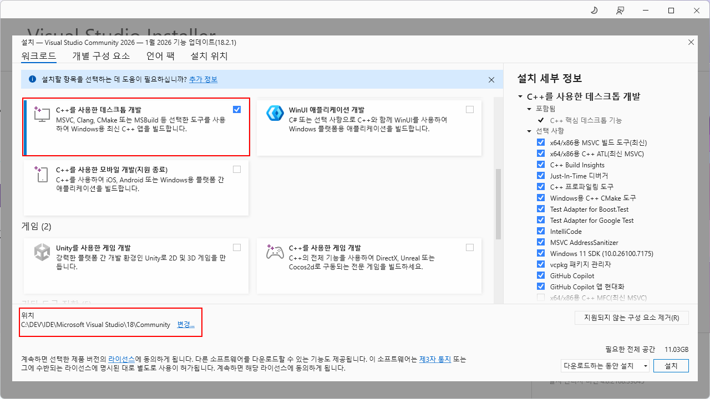
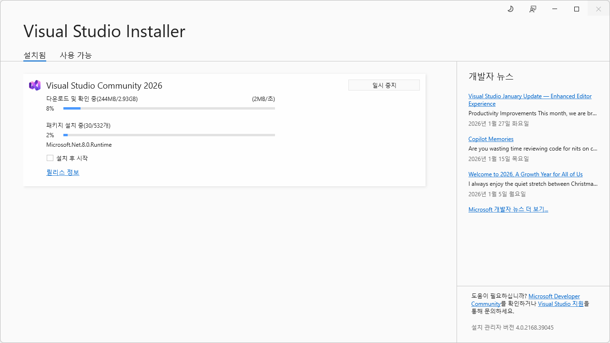
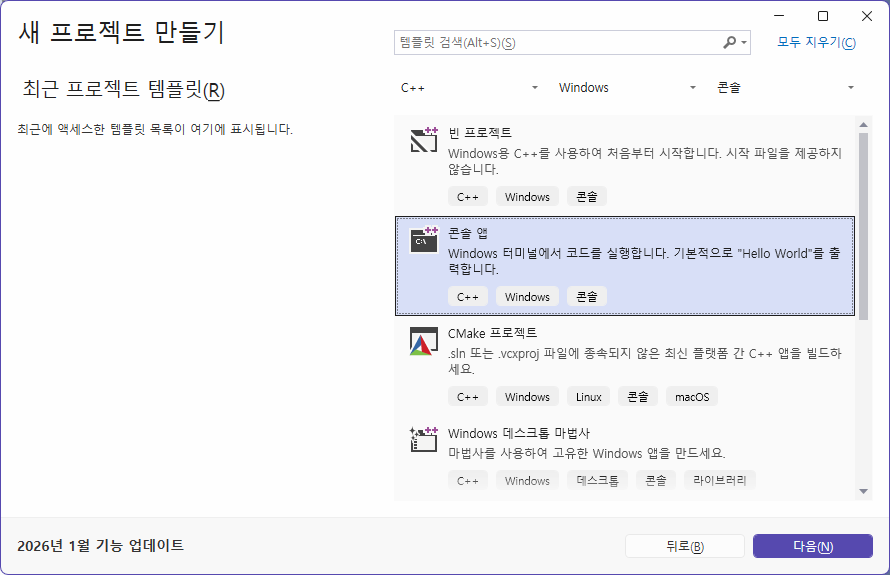
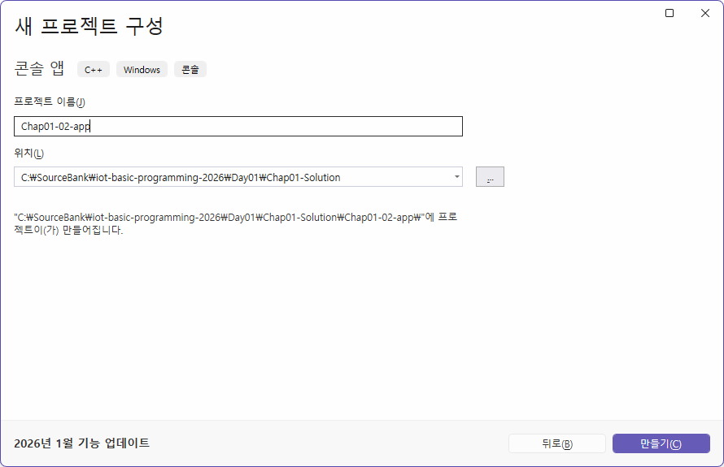
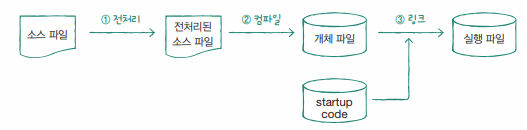

# iot-basic-programing-2026
IoT 개발자과정 기초 프로그래밍 언어 학습 리포지토리

## 1일차
- Git,Github Desktop 설치
- Visual studio code 설치
- readme 미리보기 : ctrl + shift + v

### C언어 학습 순서
- 기본
    1. 프로그램 기본
    2. 상수와 데이터 출력
    3. 변수와 데이터 입력
    4. 연산자
    5. 제어문, `분기문`과 `반복문`
    6. 함수
- 고급
    1. 배열
    2. `포인터` !!
    3. 배열과 포인터
    4. 문자열과 포인터
    5. 변수의 영역과 데이터 공유
    6. 다차원 포인터
    7. 구조체 자료형
    8. 파일 입출력
    9. 전처리와 분할 컴파일

### 프로그램 개요
- 프로그램이란 : `사용자의 요구`에 따라 `데이터를 처리`(표현,이동,저장,로드...)할 수 있는 `소프트웨어`
    - 일의 순서가 의미함. 일의 순서를 컴퓨터 내에서 실행하는 것
- 프로그램을 만다는 작업 : 프로그래밍(코딩,SW개발,소프트웨어 엔지니어)

### C언어
- 1972년 켄 톰슨과 데니스 리치가 Unix 운영체제 개발하기 위해 만든 언어
- C++,java,C#,Python등 모든 언어의 기본이 되는 언어
- C99 표준에 따라서 학습 

### 컴파일과 컴파일러
- 소스코드파일(텍스트파일)을 컴퓨터가 실행할 수 있는 파일로 변경,생성
    - 전처리,링킹,오브젝트화,실행파일로...
    - C, cpp -> 확장자 exe 파일로 생성
- 컴파일러 : IDE(Integrity Development Environment)
    - Visual Studio,Visual Studio Code,Rider,Ecplise...

### 비주얼 스튜디오 설치
- https://visualstudio.microsoft.com/ko 다운로드
    1. visual studio installer 실행
        
    2. 설치 중
        

### 비주얼 스튜디오 프로젝트 생성
1. 새 프로젝트 만들기
    
2. 새 프로젝트 구성
    - 솔루션 이름, 프로젝트 이름을 다르게 지정
    - 위치는 깃헙 저장소 하위에 위치
    
3. 새 프로젝트 추가
    - 기존 솔루션에 새 프로젝트 추가
    
4. 소스코드 확장자를 변경
    -*.cpp -> *.c 로 변경

5. 01,02,c 코딩
6. 메뉴 디버그 > 디버그하지 않고 시작(ctrl + F5) 클릭
7. 컴파일 과정

    
8. 프로젝트가 여러개일때
    - 솔루션 속성 > 시작 프로젝트 구성 > `현재 선택 영역`으로 선택

### C 기본 문법

1. 기본 사용법
    - 메인함수 작성법 : [확인](./Day01/Chap02-Solution/Chap02-01-app/main.c)
    - 데이터 출력방법 : [확인](./Day01/Chap02-Solution/Chap02-02-app/main.c)

    - 진법 사용방법 : 아래확인
        - 2진수 -> 컴퓨터의 데이터가 모두 0,1로만 저장되어 있으므로
        - 8진수 -> 비트로 데이터를 처리할 때 비트단위가 8이므로
        - 16진수 _> 255까지의 수를 짧게 표현하고자 사용
        - 10진수 -> 실생활 사용

    - 진수별 표현법 : [확인](./Day01/Chap02-Solution/Chap02-03-app/main.c)
        |10진수|0|1|2|3|4|5|6|7|8|9|10|11|12|13|14|15|
        |:---:|:---:|:---:|:---:|:---:|:---:|:---:|:---:|:---:|:---:|:---:|:---:|:---:|:---:|:---:|:---:|:---:|
        |8진수|0|1|2|3|4|5|6|7|10|11|12|13|14|15|16|17
        |16진수|0x0|0x1|0x2|0x3|0x4|0x5|0x6|0x7|0x8|0x9|0xA|0xB|0xC|0xD|0xE|0xF|

